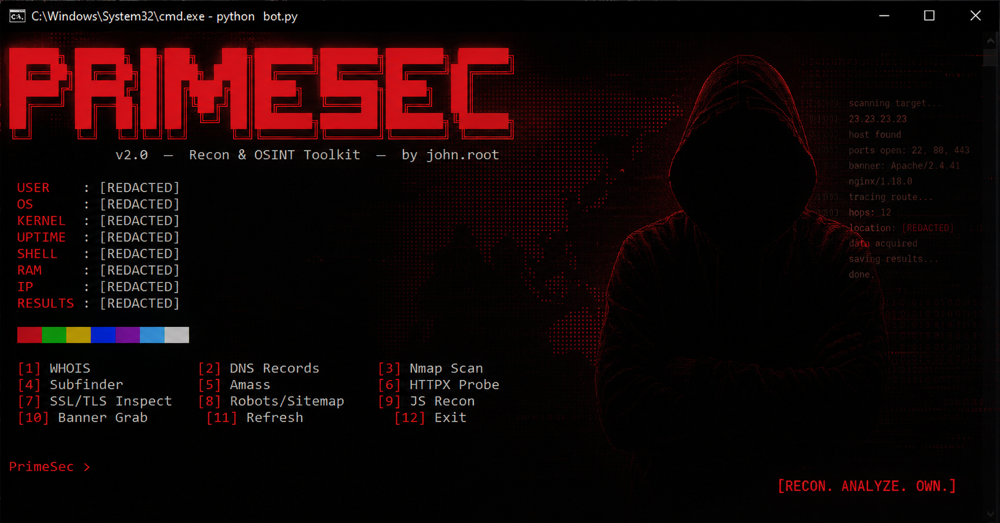

<div align="center">

# 🦅 PrimeSec

**Modular Recon & OSINT Toolkit — one CLI for the tools you already use**

`WHOIS` · `DNS` · `Nmap` · `Subfinder` · `Amass` · `HTTPX` · `SSL/TLS` · `Robots/Sitemap` · `JS Recon` · `Banner Grab`


*by [john.root](https://github.com/john-root)*

</div>

---

## Screenshot

<div align="center">

</div>

---

## Overview

PrimeSec wraps the recon tools you'd normally juggle across a dozen terminal tabs — WHOIS, Nmap, Subfinder, Amass, HTTPX, and more — behind a single, consistent, color-coded CLI. Every scan is automatically logged to disk as `.txt` and `.json`, so results never get lost when the terminal closes.

Built for quick recon during authorized penetration tests, bug bounty recon, and OSINT gathering.

## Features

| Module | Description |
|---|---|
| **WHOIS** | Domain registration, registrar, expiry, and name server lookup |
| **DNS Records** | A, AAAA, MX, NS, TXT, CNAME, SOA enumeration |
| **Nmap Scan** | Quick, comprehensive, stealth (SYN), and full port-sweep scans |
| **Subfinder** | Fast passive subdomain enumeration |
| **Amass** | Deep passive/active asset discovery |
| **HTTPX Probe** | Live host probing with title, status code, and tech detection |
| **SSL/TLS Inspect** | Certificate issuer, validity window, TLS version, cipher suite |
| **Robots/Sitemap** | Crawls `robots.txt` and `sitemap.xml` for disclosed paths/URLs |
| **JS Recon** | Hunts JS files for API keys, secrets, AWS keys, endpoints, emails |
| **Banner Grab** | Raw TCP banner grabbing across common service ports |

Every module:
- Auto-saves results to `primesec_results/` (`.txt` + `.json`)
- Shows a live spinner during long-running scans
- Gracefully warns and gives install hints when an external binary is missing

## Installation

```bash
git clone https://github.com/<your-username>/primesec-recon.git
cd primesec-recon
python3 primesec.py
```

Python dependencies (`python-nmap`, `python-whois`, `requests`, `beautifulsoup4`, `colorama`, `psutil`, `dnspython`) are detected and installed automatically on first run — no manual `pip install` needed.

### External tool dependencies

A few modules shell out to standalone Go-based recon tools. Install the ones you plan to use:

```bash
# Nmap
sudo apt install nmap          # Linux
brew install nmap              # macOS

# Subfinder
go install -v github.com/projectdiscovery/subfinder/v2/cmd/subfinder@latest

# Amass
go install -v github.com/owasp-amass/amass/v4/...@master

# HTTPX
go install -v github.com/projectdiscovery/httpx/cmd/httpx@latest
```

PrimeSec will tell you exactly which binary is missing and how to install it if you try to run a module without it.

## Usage

```bash
python3 primesec.py
```

Pick a module from the menu, enter your target, and let it run. Results are written to:

```
primesec_results/<target>_<module>_<timestamp>.txt
primesec_results/<target>_<module>_<timestamp>.json
```

Some modules (Nmap comprehensive/stealth scans) require root/administrator privileges:

```bash
sudo python3 primesec.py
```

## Legal / Responsible Use

PrimeSec is built for **authorized security testing, bug bounty programs, and OSINT research only**. Only scan assets you own or have explicit written permission to test. The author is not responsible for misuse of this tool. Unauthorized scanning of systems you don't own may be illegal in your jurisdiction.

## License

Released under the [MIT License](LICENSE).

## Author

**john.root**
If PrimeSec saved you time, a ⭐ on the repo is appreciated.
